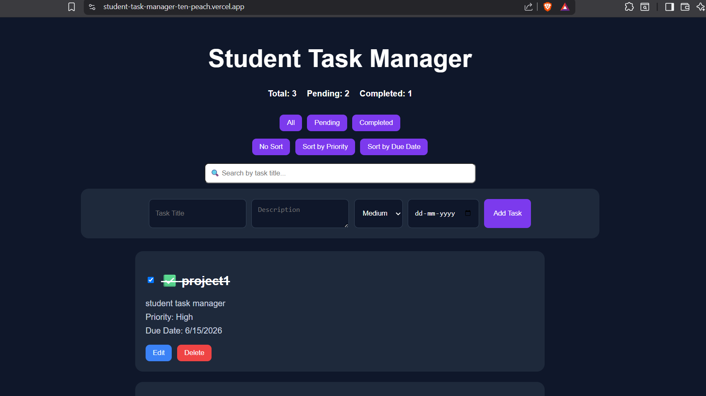
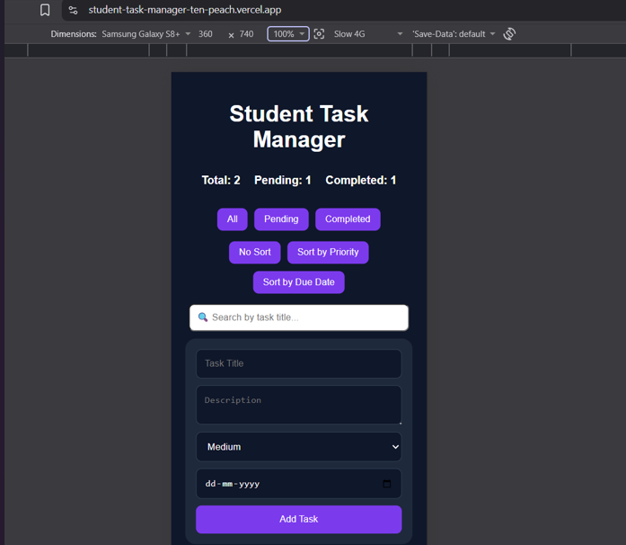
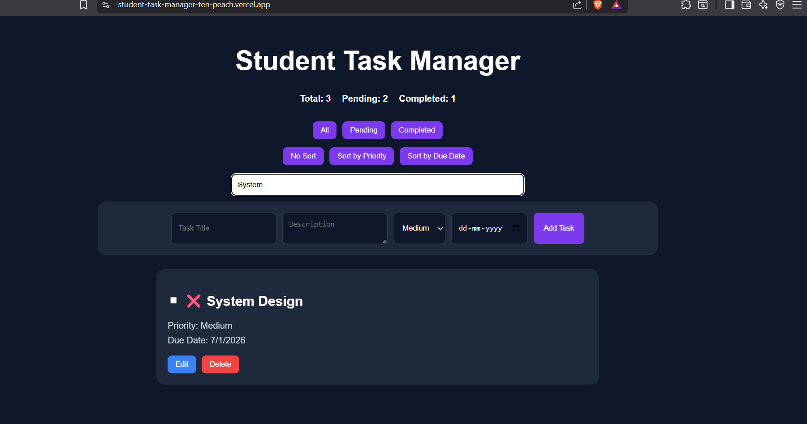

# Student Task Manager

A full-stack task management web application built using React, Node.js, Express, and MongoDB.

## Features

- Add Task
- Edit Task
- Delete Task
- Mark Complete / Uncomplete
- Filter Tasks (All / Pending / Completed)
- Sort by Priority
- Sort by Due Date
- Search Tasks
- Responsive UI
- MongoDB Database Integration

## Tech Stack

### Frontend

- React (Vite)
- CSS
- Axios

### Backend

- Node.js
- Express.js
- MongoDB Atlas
- Mongoose

## Screenshots

### Home Page

### Mobile View

### Search Feature

## Live Demo

https://student-task-manager-ten-peach.vercel.app/
